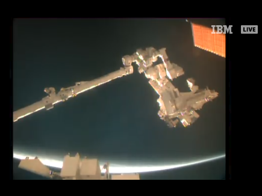
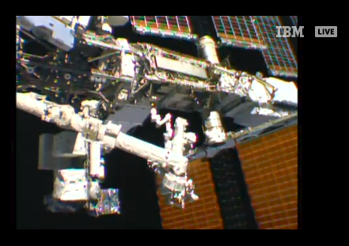

# MMM-ISS-Live

**MMM-ISS-Live** is module for [MagicMirror²](https://github.com/MagicMirrorOrg/MagicMirror) to display a live video stream from the International Space Station.

Live video from the International Space Station includes internal views when the crew is on-duty and Earth views at other times. The video is accompanied by audio of conversations between the crew and Mission Control. This video is only available when the space station is in contact with the ground.

During "loss of signal" periods, viewers will see a blue screen. Since the station orbits the Earth once every 90 minutes, it experiences a sunrise or a sunset about every 45 minutes. When the station is in darkness, external camera video may appear black, but can sometimes provide spectacular views of lightning or city lights below.

## Screenshots

 

## Installation

Go to the directory where the modules are stored and download this module by using `git clone`:

```bash
cd ~/MagicMirror/modules
git clone https://github.com/KristjanESPERANTO/MMM-ISS-Live
```

## Update

Go to the module’s directory and pull the latest version from GitHub:

```bash
cd ~/MagicMirror/modules/MMM-ISS-Live
git pull
```

## Configuration

### Easy example

```js
    {
      module: "MMM-ISS-Live",
      position: "bottom_left"
    },
```

### Adapted example

```js
    {
      module: "MMM-ISS-Live",
      header: "ISS Live Stream", // With header
      position: "bottom_left",
      config: {
        url: "https://www.youtube.com/embed/xRPjKQtRXR8?si=zi-AnQaKiuwKkaLR", // Another video stream
        height: "540px",         // Double height than default
        width: "960px",          // Double width than default
        mute: false              // Sound enabled
      }
    },
```

There are several video streams from the ISS on YouTube. To switch to another stream, you need to set the URL option as in the customized example above.

- _LIVE: NASA Live Stream of Earth from Space (ISS)_
  `"https://www.youtube.com/embed/xRPjKQtRXR8?si=zi-AnQaKiuwKkaLR"`
- _Live Video from the International Space Station (Official NASA Stream)_ - **Default**
  `"https://www.youtube.com/embed/OCem0E-0Q6Y?si=ABf9IB2wDLzHxgeW"`

**Side note:** _Basically you can use this module to embed any YouTube video. You only need to find out the embedded URL of the video and enter it as url option._

## Project status

Since the original module didn't work anymore and the author, [Mykle1](https://github.com/Mykle1), is no longer active, I forked the module. I fixed a few issues and will try to keep the module working in the future.

**This module is in maintenance mode.**

## Known issues

If you use pi-hole or any other ad blocker, you may need to whitelist some ad URLs to get the video stream working. Check out the browser console for the URL(s).

## Contributing

If you find any problems, bugs or have questions, please [open a GitHub issue](https://github.com/KristjanESPERANTO/MMM-ISS-Live/issues) in this repository.

Pull requests are of course also very welcome 🙂

### Code of Conduct

Please note that this project is released with a [Contributor Code of Conduct](CODE_OF_CONDUCT.md). By participating in this project you agree to abide by its terms.

### Developer commands

- `npm install` - Install dependencies like ESLint and prettier.
- `npm run lint` - Run linting and formatter checks.
- `npm run lint:fix` - Fix linting and formatter issues.
- `npm run test` - Run linting and formatter checks + Run spelling check.
- `npm run test:spelling` - Run spelling check.
